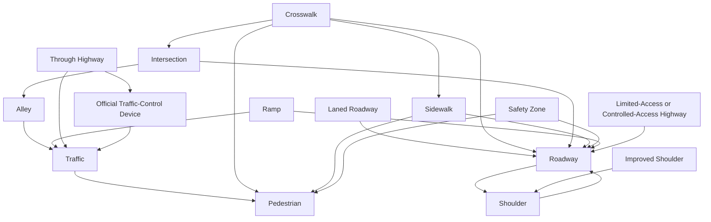
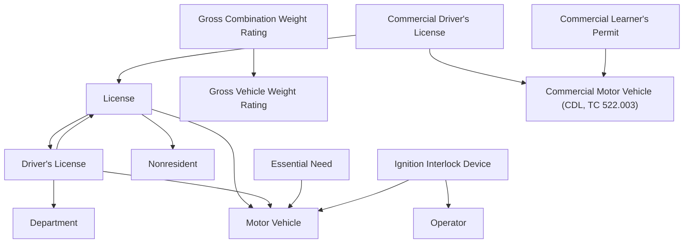
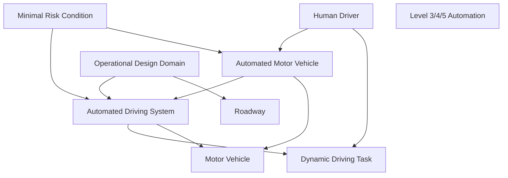
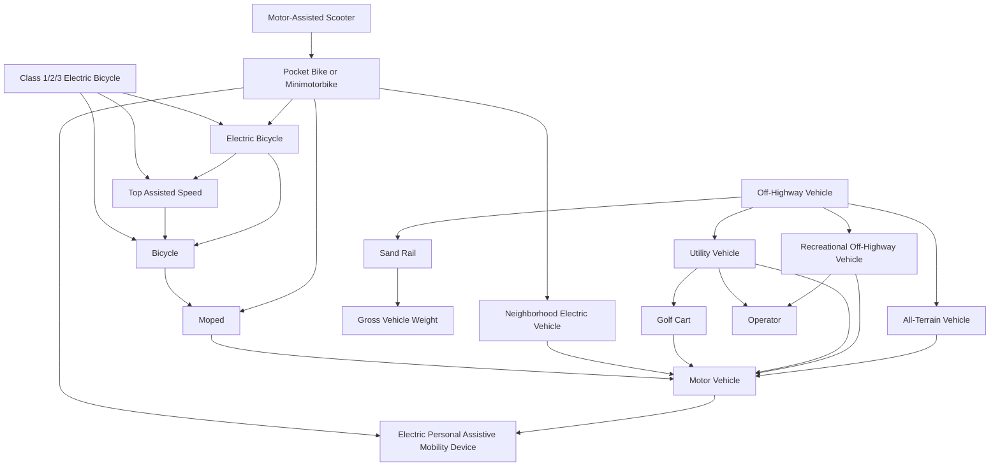
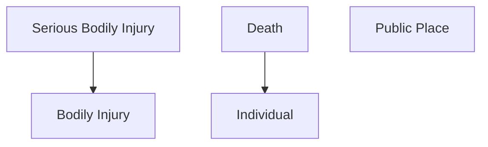

# Chapter 22 Traffic Code — Definition Cross-Reference Map

This maps every term in the [Chapter 22 Definitions bank](../alt-quizzes/bank/22-traffic-code-definitions.md) against every *other* defined term it explicitly uses or builds on, so you can see which definitions are foundational ("hub" terms other definitions are built from) and which are compound/derived. Two kinds of relationship are shown:

- **Explicit** — the statute says "has the meaning assigned by Section X" or otherwise names the section.
- **Implicit/generic** — the definition's own text is written *using* another defined term as its genus (e.g. "'Motor vehicle' means a self-propelled **vehicle**..." — Motor Vehicle is a species of Vehicle) or as an explicit inclusion/exclusion ("other than a **pole trailer**").

A handful of same-spelled terms are **independently redefined** chapter to chapter (Vehicle, Motor Vehicle, Trailer, Semitrailer, Commercial Motor Vehicle, Motorcycle, Department, Director, Board, School Bus) rather than inheriting one shared meaning — those are flagged separately below since they're a common source of missed exam questions.

*Methodology note: built by cross-scanning the actual TC/HSC/PC statute text behind all 137 questions in the definitions bank; word-overlap that turned out to be ordinary English rather than a real legal cross-reference (e.g. "in this state," "public highway" used generically in an unrelated code) was manually reviewed out.*

## Hub terms — what the most other definitions are built from

| Term | Source | # of other Ch.22 terms that reference it |
|---|---|---|
| **Vehicle (TC 541.201)** | TC 541.201(23) | 37 |
| **Motor Vehicle** | TC 541.201(11) | 34 |
| **Person** | TC 541.001(4) | 20 |
| **Traffic** | TC 541.301 | 16 |
| **Roadway** | TC 541.302(11) | 10 |
| **Operator** | TC 541.001(1-a) | 7 |
| **Pedestrian** | TC 541.001(3) | 5 |
| **Bicycle** | TC 541.201(2) | 4 |
| **Electric Personal Assistive Mobility Device** | TC 551.201 | 4 |
| **Department** | TC 541.002(1) | 4 |
| **Moped** | TC 541.201(8) | 4 |
| **Truck** | TC 541.201(21) | 4 |
| **Motorcycle (TC 541.201)** | TC 541.201(9) | 4 |
| **Local Authority** | TC 541.002(3) | 3 |
| **Individual** | PC 1.07(a)(26) | 3 |

## Cross-reference table, by cluster

### Vehicle Taxonomy (TC 541.201)

| Term | Source | References these terms | Referenced by |
|---|---|---|---|
| Vehicle (TC 541.201) | TC 541.201(23) | Person | Operator, Owner, Authorized Emergency Vehicle, Implement of Husbandry, Motor Vehicle, Pole Trailer, Police Vehicle, Road Tractor (TC 541.201), Semitrailer (TC 541.201), Special Mobile Equipment, Towable Recreational Vehicle, Trailer (TC 541.201), Truck Tractor (TC 541.201), Traffic, Ramp, Gross Vehicle Weight, Park or Parking, Right-of-Way, Stand or Standing, Stop or Stopping, Litter, Gross Combination Weight Rating, Gross Vehicle Weight Rating, Pass or Passing, Automated Driving System, Dynamic Driving Task, Highway Maintenance or Construction Vehicle, Road Machinery, Service Vehicle, Slow-Moving Vehicle, Commercial Motor Vehicle (Inspection, TC 548.001), Neighborhood Electric Vehicle, Pocket Bike or Minimotorbike, Sand Rail, Motorcycle (TC 661.001), Farm Semitrailer or Farm Trailer, Power Sweeper |
| Motor Vehicle | TC 541.201(11) | Electric Bicycle (541.201 cross-ref), Electric Personal Assistive Mobility Device, Vehicle (TC 541.201) | Bus, Farm Tractor, Implement of Husbandry, Moped, Motorcycle (TC 541.201), Multifunction School Activity Bus, Passenger Car, Road Tractor (TC 541.201), School Bus (TC 541.201), Semitrailer (TC 541.201), Towable Recreational Vehicle, Trailer (TC 541.201), Truck, Truck Tractor (TC 541.201), Litter, Driver's License, License, Essential Need, Ignition Interlock Device, Automated Driving System, Automated Motor Vehicle, Slow-Moving Vehicle, Neighborhood Electric Vehicle, Golf Cart, All-Terrain Vehicle, Recreational Off-Highway Vehicle, Utility Vehicle, Motorcycle (TC 661.001), Autocycle, Commercial Motor Vehicle (Registration, TC 502.001), Commercial Motor Vehicle (Size & Weight, TC 621.001), Semitrailer (TC 621.001), Trailer (TC 621.001), Vehicle (TC 621.001) |
| Authorized Emergency Vehicle | TC 541.201(1) | Department, Police Vehicle, Vehicle (TC 541.201) | — |
| Bicycle | TC 541.201(2) | Moped | Sidewalk User, Electric Bicycle, Top Assisted Speed, Class 1/2/3 Electric Bicycle |
| Bus | TC 541.201(3) | Motor Vehicle, Operator, Person | — |
| Farm Tractor | TC 541.201(4) | Implement of Husbandry, Motor Vehicle | — |
| House Trailer | TC 541.201(5) | Semitrailer (TC 541.201), Towable Recreational Vehicle, Trailer (TC 541.201) | Special Mobile Equipment |
| Implement of Husbandry | TC 541.201(6) | Motor Vehicle, Passenger Car, Truck, Vehicle (TC 541.201) | Farm Tractor, Slow-Moving Vehicle |
| Light Truck | TC 541.201(7) | Truck | — |
| Moped | TC 541.201(8) | Motor Vehicle | Bicycle, Motorcycle (TC 541.201), Pocket Bike or Minimotorbike, Commercial Motor Vehicle (Registration, TC 502.001) |
| Motorcycle (TC 541.201) | TC 541.201(9) | Moped, Motor Vehicle | Passenger Car, Pocket Bike or Minimotorbike, Commercial Motor Vehicle (Registration, TC 502.001), Commercial Motor Vehicle (Size & Weight, TC 621.001) |
| Multifunction School Activity Bus | TC 541.201(11-a) | Motor Vehicle, School Activity Bus, School Bus (TC 541.201) | School Activity Bus, School Bus (TC 545.001, Ch.545 purposes) |
| Passenger Car | TC 541.201(12) | Motor Vehicle, Motorcycle (TC 541.201), Operator, Person | Implement of Husbandry, Commercial Motor Vehicle (Registration, TC 502.001) |
| Pole Trailer | TC 541.201(13) | Vehicle (TC 541.201) | Semitrailer (TC 541.201), Trailer (TC 541.201) |
| Police Vehicle | TC 541.201(13-a) | Department, Vehicle (TC 541.201) | Authorized Emergency Vehicle |
| Road Tractor (TC 541.201) | TC 541.201(14) | Motor Vehicle, Vehicle (TC 541.201) | — |
| School Activity Bus | TC 541.201(15) | Multifunction School Activity Bus, Operator, School Bus (TC 541.201) | Multifunction School Activity Bus, Commercial Motor Vehicle (Inspection, TC 548.001) |
| School Bus (TC 541.201) | TC 541.201(16) | Motor Vehicle | Multifunction School Activity Bus, School Activity Bus |
| Semitrailer (TC 541.201) | TC 541.201(17) | Motor Vehicle, Pole Trailer, Vehicle (TC 541.201) | House Trailer |
| Special Mobile Equipment | TC 541.201(18) | House Trailer, Person, Truck, Vehicle (TC 541.201) | — |
| Towable Recreational Vehicle | TC 541.201(19) | Motor Vehicle, Vehicle (TC 541.201) | House Trailer |
| Trailer (TC 541.201) | TC 541.201(20) | Motor Vehicle, Pole Trailer, Vehicle (TC 541.201) | House Trailer |
| Truck | TC 541.201(21) | Motor Vehicle | Implement of Husbandry, Light Truck, Special Mobile Equipment, Service Vehicle |
| Truck Tractor (TC 541.201) | TC 541.201(22) | Motor Vehicle, Vehicle (TC 541.201) | — |
| Electric Bicycle (541.201 cross-ref) | TC 541.201(24) | — | Motor Vehicle |

### Persons, Authorities & Districts (TC 541.001/.002/.101/.102)

| Term | Source | References these terms | Referenced by |
|---|---|---|---|
| Operator | TC 541.001(1-a) | Person, Vehicle (TC 541.201) | Bus, Passenger Car, School Activity Bus, Ignition Interlock Device, Recreational Off-Highway Vehicle, Utility Vehicle, Motorcycle (TC 661.001) |
| Owner | TC 541.001(2) | Person, Vehicle (TC 541.201) | Private Road or Driveway, Operate Temporarily on the Highways |
| Pedestrian | TC 541.001(3) | Person | Traffic, Crosswalk, Safety Zone, Sidewalk, Right-of-Way |
| Person | TC 541.001(4) | — | Operator, Owner, Pedestrian, School Crossing Guard, Police Officer, Bus, Passenger Car, Special Mobile Equipment, Vehicle (TC 541.201), Limited-Access or Controlled-Access Highway, Private Road or Driveway, Nonresident, Essential Need, Habitual Violator, Human Driver, Minimal Risk Condition, Road Machinery, Safety Glazing Material, Electric Personal Assistive Mobility Device, Vehicle (TC 621.001) |
| School Crossing Guard | TC 541.001(5) | Local Authority, Person, School Crossing Zone, Traffic | Local Authority |
| Sidewalk User | TC 541.001(6) | Bicycle, Electric Personal Assistive Mobility Device, Individual, Motor-Assisted Scooter, Sidewalk | — |
| Escort Flagger | TC 541.001(1) | — | — |
| Department | TC 541.002(1) | — | Authorized Emergency Vehicle, Police Vehicle, Driver's License, Sunscreening Device |
| Director | TC 541.002(2) | — | Slow-Moving-Vehicle Emblem |
| Local Authority | TC 541.002(3) | School Crossing Guard, Traffic | School Crossing Guard, School Crossing Zone, School Crosswalk |
| Police Officer | TC 541.002(4) | Person, Traffic | Stop or Stopping |
| State | TC 541.002(5) | — | — |
| Metropolitan Area | TC 541.101 | Urban District | — |
| Business District | TC 541.102(1) | — | Residence District |
| Residence District | TC 541.102(2) | Business District | — |
| Urban District | TC 541.102(3) | — | Metropolitan Area |

### Traffic, Traffic Areas & Traffic Control (TC 541.301-304, 542.202)

| Term | Source | References these terms | Referenced by |
|---|---|---|---|
| Traffic | TC 541.301 | Pedestrian, Vehicle (TC 541.201) | School Crossing Guard, Local Authority, Police Officer, Alley, Freeway, Freeway Main Lane, Ramp, Official Traffic-Control Device, Railroad Sign or Signal, Traffic-Control Signal, Through Highway, Stop or Stopping, Habitual Violator, Operational Design Domain, Highway Maintenance or Construction Vehicle, Service Vehicle |
| Alley | TC 541.302(1) | Traffic | Intersection |
| Crosswalk | TC 541.302(2) | Intersection, Pedestrian, Roadway, Sidewalk | School Crosswalk |
| Freeway | TC 541.302(3) | Traffic | Freeway Main Lane |
| Freeway Main Lane | TC 541.302(4) | Freeway, Traffic | — |
| Highway or Street | TC 541.302(5) | — | — |
| Improved Shoulder | TC 541.302(6) | Shoulder | — |
| Laned Roadway | TC 541.302(7) | Roadway | — |
| Limited-Access or Controlled-Access Highway | TC 541.302(8) | Person, Roadway | — |
| Private Road or Driveway | TC 541.302(9) | Owner, Person | — |
| Ramp | TC 541.302(10) | Roadway, Traffic, Vehicle (TC 541.201) | — |
| Roadway | TC 541.302(11) | Shoulder | Crosswalk, Laned Roadway, Limited-Access or Controlled-Access Highway, Ramp, Safety Zone, Shoulder, Sidewalk, Intersection, Operational Design Domain, Incident |
| Safety Zone | TC 541.302(12) | Pedestrian, Roadway | — |
| School Crossing Zone | TC 541.302(13) | Local Authority | School Crossing Guard |
| School Crosswalk | TC 541.302(14) | Crosswalk, Local Authority | — |
| Shoulder | TC 541.302(15) | Roadway | Improved Shoulder, Roadway |
| Sidewalk | TC 541.302(16) | Pedestrian, Roadway | Sidewalk User, Crosswalk |
| Intersection | TC 541.303 | Alley, Roadway | Crosswalk |
| Official Traffic-Control Device | TC 541.304(1) | Traffic | Through Highway |
| Railroad Sign or Signal | TC 541.304(2) | Traffic | — |
| Traffic-Control Signal | TC 541.304(3) | Traffic | — |
| Through Highway | TC 542.202(b)(2) | Official Traffic-Control Device, Right-of-Way, Traffic | — |

### Miscellaneous Terms (TC 541.401)

| Term | Source | References these terms | Referenced by |
|---|---|---|---|
| Daytime | TC 541.401(1) | — | — |
| Gross Vehicle Weight | TC 541.401(4) | Vehicle (TC 541.201) | Sand Rail |
| Nighttime | TC 541.401(5) | — | — |
| Park or Parking | TC 541.401(6) | Vehicle (TC 541.201) | — |
| Personal Injury | TC 541.401(7) | — | — |
| Right-of-Way | TC 541.401(8) | Pedestrian, Vehicle (TC 541.201) | Through Highway |
| Stand or Standing | TC 541.401(9) | Vehicle (TC 541.201) | — |
| Stop or Stopping | TC 541.401(10) | Police Officer, Traffic, Vehicle (TC 541.201) | — |

### Litter / Illegal Dumping (HSC 365.011-.012)

| Term | Source | References these terms | Referenced by |
|---|---|---|---|
| Dispose or Dump | HSC 365.011(5) | Litter | — |
| Litter | HSC 365.011(6) | Motor Vehicle, Vehicle (TC 541.201) | Dispose or Dump, Illegal Dumping, Power Sweeper |
| Public Highway (HSC) | HSC 365.011(8) | — | Illegal Dumping |
| Illegal Dumping | HSC 365.012(a) | Litter, Public Highway (HSC) | — |

### Driver's License / CDL (TC 521.001, 521.241, 521.292(b), 522.003)

| Term | Source | References these terms | Referenced by |
|---|---|---|---|
| Driver's License | TC 521.001(a)(3) | Department, License, Motor Vehicle | License |
| Gross Combination Weight Rating | TC 522.003(17) | Gross Vehicle Weight Rating, Vehicle (TC 541.201) | — |
| Gross Vehicle Weight Rating | TC 522.003(18) | Vehicle (TC 541.201) | Gross Combination Weight Rating |
| License | TC 521.001(a)(6) | Driver's License, Motor Vehicle, Nonresident | Driver's License, Commercial Driver's License |
| Nonresident | TC 521.001(a)(7) | Person | License |
| Essential Need | TC 521.241(1) | Motor Vehicle, Person | — |
| Ignition Interlock Device | TC 521.241(2) | Motor Vehicle, Operator | — |
| Habitual Violator | TC 521.292(b) | Person, Traffic | — |
| Commercial Driver's License | TC 522.003(3) | Commercial Motor Vehicle (CDL, TC 522.003), Individual, License | — |
| Commercial Learner's Permit | TC 522.003(4) | Commercial Motor Vehicle (CDL, TC 522.003) | — |
| Commercial Motor Vehicle (CDL, TC 522.003) | TC 522.003(5) | — | Commercial Driver's License, Commercial Learner's Permit |

### Chapter 545 & Automated Vehicles (TC 545.001, 545.451)

| Term | Source | References these terms | Referenced by |
|---|---|---|---|
| Pass or Passing | TC 545.001(2) | Vehicle (TC 541.201) | — |
| School Bus (TC 545.001, Ch.545 purposes) | TC 545.001(3) | Multifunction School Activity Bus | — |
| Automated Driving System | TC 545.451(1) | Dynamic Driving Task, Motor Vehicle, Vehicle (TC 541.201) | Automated Motor Vehicle, Minimal Risk Condition, Operational Design Domain |
| Automated Motor Vehicle | TC 545.451(2) | Automated Driving System, Motor Vehicle | Human Driver, Minimal Risk Condition |
| Dynamic Driving Task | TC 545.451(6) | Vehicle (TC 541.201) | Automated Driving System, Human Driver |
| Human Driver | TC 545.451(7) | Automated Motor Vehicle, Dynamic Driving Task, Person | — |
| Level 3/4/5 Automation | TC 545.451(8)-(10) | — | — |
| Minimal Risk Condition | TC 545.451(11) | Automated Driving System, Automated Motor Vehicle, Person | — |
| Operational Design Domain | TC 545.451(12) | Automated Driving System, Roadway, Traffic | — |

### Equipment & Inspection (TC 547.001, 548.001)

| Term | Source | References these terms | Referenced by |
|---|---|---|---|
| Highway Maintenance or Construction Vehicle | TC 547.001(2-b) | Traffic, Vehicle (TC 541.201) | — |
| Light Transmission | TC 547.001(3) | — | — |
| Road Machinery | TC 547.001(5-a) | Person, Vehicle (TC 541.201) | — |
| Safety Glazing Material | TC 547.001(6) | Person | — |
| Service Vehicle | TC 547.001(6-a) | Traffic, Truck, Utility Vehicle, Vehicle (TC 541.201) | — |
| Slow-Moving Vehicle | TC 547.001(7) | Electric Personal Assistive Mobility Device, Implement of Husbandry, Motor Vehicle, Vehicle (TC 541.201) | — |
| Slow-Moving-Vehicle Emblem | TC 547.001(8) | Director | — |
| Sunscreening Device | TC 547.001(9) | Department | — |
| Commercial Motor Vehicle (Inspection, TC 548.001) | TC 548.001(1) | School Activity Bus, Vehicle (TC 541.201) | — |

### Bicycles, Scooters, Golf Carts, Off-Highway Vehicles (TC 551.201/.301/.351/.401, 664.001, 551A.001)

| Term | Source | References these terms | Referenced by |
|---|---|---|---|
| Electric Personal Assistive Mobility Device | TC 551.201 | Person | Sidewalk User, Motor Vehicle, Slow-Moving Vehicle, Pocket Bike or Minimotorbike |
| Neighborhood Electric Vehicle | TC 551.301 | Motor Vehicle, Vehicle (TC 541.201) | Pocket Bike or Minimotorbike |
| Motor-Assisted Scooter | TC 551.351(1) | Pocket Bike or Minimotorbike | Sidewalk User |
| Pocket Bike or Minimotorbike | TC 551.351(2) | Electric Bicycle, Electric Personal Assistive Mobility Device, Moped, Motorcycle (TC 541.201), Neighborhood Electric Vehicle, Vehicle (TC 541.201) | Motor-Assisted Scooter |
| Golf Cart | TC 551.401 | Motor Vehicle | Utility Vehicle |
| Electric Bicycle | TC 664.001(4) | Bicycle, Top Assisted Speed | Pocket Bike or Minimotorbike, Class 1/2/3 Electric Bicycle |
| Top Assisted Speed | TC 664.001(5) | Bicycle | Electric Bicycle, Class 1/2/3 Electric Bicycle |
| Class 1/2/3 Electric Bicycle | TC 664.001(1)-(3) | Bicycle, Electric Bicycle, Top Assisted Speed | — |
| All-Terrain Vehicle | TC 551A.001(1) | Motor Vehicle | Off-Highway Vehicle |
| Off-Highway Vehicle | TC 551A.001(1-d) | All-Terrain Vehicle, Recreational Off-Highway Vehicle, Sand Rail, Utility Vehicle | — |
| Sand Rail | TC 551A.001(3) | Gross Vehicle Weight, Vehicle (TC 541.201) | Off-Highway Vehicle |
| Recreational Off-Highway Vehicle | TC 551A.001(5) | Motor Vehicle, Operator | Off-Highway Vehicle |
| Utility Vehicle | TC 551A.001(6) | Golf Cart, Motor Vehicle, Operator | Service Vehicle, Off-Highway Vehicle |
| Beach | TC 551A.001(2) | — | — |
| Public Off-Highway Vehicle Land | TC 551A.001(4) | — | — |

### Motorcycles & Criminal Street Gang (TC 661.001/.0015, PC 71.01(d))

| Term | Source | References these terms | Referenced by |
|---|---|---|---|
| Motorcycle (TC 661.001) | TC 661.001(1) | Motor Vehicle, Operator, Vehicle (TC 541.201) | Autocycle |
| Autocycle | TC 661.0015(a) | Motor Vehicle, Motorcycle (TC 661.001) | — |
| Criminal Street Gang | PC 71.01(d) | — | — |

### Vehicle Registration (TC 502.001)

| Term | Source | References these terms | Referenced by |
|---|---|---|---|
| Commercial Motor Vehicle (Registration, TC 502.001) | TC 502.001(7) | Moped, Motor Vehicle, Motorcycle (TC 541.201), Passenger Car | — |
| Farm Semitrailer or Farm Trailer | TC 502.001(15) | Vehicle (TC 541.201) | — |
| Operate Temporarily on the Highways | TC 502.001(30) | Owner | — |
| Power Sweeper | TC 502.001(33) | Litter, Vehicle (TC 541.201) | — |
| Public Property | TC 502.001(36) | — | — |

### Vehicle Size & Weight (TC 621.001)

| Term | Source | References these terms | Referenced by |
|---|---|---|---|
| Commercial Motor Vehicle (Size & Weight, TC 621.001) | TC 621.001(1) | Motor Vehicle, Motorcycle (TC 541.201) | Vehicle (TC 621.001) |
| Semitrailer (TC 621.001) | TC 621.001(6) | Motor Vehicle, Vehicle (TC 621.001) | Vehicle (TC 621.001) |
| Trailer (TC 621.001) | TC 621.001(7) | Motor Vehicle, Vehicle (TC 621.001) | Vehicle (TC 621.001) |
| Vehicle (TC 621.001) | TC 621.001(9) | Commercial Motor Vehicle (Size & Weight, TC 621.001), Motor Vehicle, Person, Semitrailer (TC 621.001), Trailer (TC 621.001) | Semitrailer (TC 621.001), Trailer (TC 621.001) |

### Penal Code Cross-References (PC 1.07)

| Term | Source | References these terms | Referenced by |
|---|---|---|---|
| Bodily Injury | PC 1.07(a)(8) | — | Serious Bodily Injury |
| Serious Bodily Injury | PC 1.07(a)(46) | Bodily Injury | — |
| Individual | PC 1.07(a)(26) | — | Sidewalk User, Commercial Driver's License, Death |
| Public Place | PC 1.07(a)(40) | — | — |
| Death | PC 1.07(a)(49) | Individual | — |

### Embedded BPOC Terms (BPOC 22.33/22.37/22.38)

| Term | Source | References these terms | Referenced by |
|---|---|---|---|
| Nomograph | BPOC 22.33 | — | — |
| Incident | BPOC 22.37 | Roadway | — |
| Five Areas of a Work Zone | BPOC 22.38 | — | — |

## Same name, different definition — the multi-chapter redefinition trap

A handful of terms are **not** inherited from the TC 541 Subtitle C base definitions — each chapter below independently writes its own version, so the same word means something legally different depending on which chapter you're operating under. This is a common source of missed exam questions.

| Term | Independently defined in... | Notable difference |
|---|---|---|
| **Vehicle** | TC 541.201(23) *(general/Subtitle C)*, TC 621.001(9) *(size & weight)*, TC 502.001(45) *(registration, not in bank)* | 621.001's version explicitly lists what it *includes* (motor vehicle, CMV, truck-tractor, trailer, semitrailer); 541.201's is a plain functional definition |
| **Motor Vehicle** | TC 541.201(11) *(general)*, TC 502.001(25) & 621.001(5) *(both: "a vehicle that is self-propelled")*, TC 522.003(21) *(CDL: adds "machine, tractor, trailer, or semitrailer... used on a highway")* | The CDL version is deliberately broader (catches towed combinations) than the general version |
| **Commercial Motor Vehicle** | TC 502.001(7) *(registration)*, TC 522.003(5) *(CDL — incorporated from 49 C.F.R. §383.5)*, TC 548.001(1) *(inspection — its own 26,000 lb/15-passenger/hazmat test)*, TC 621.001(1) *(size & weight — no weight/passenger threshold at all)* | Four separate legal tests; a vehicle can be a "CMV" under one chapter and not another |
| **Trailer** / **Semitrailer** | TC 541.201(17)/(20) *(general)*, TC 621.001(6)/(7) *(size & weight)* | 621.001's wording is simplified/restated rather than cross-referenced |
| **Motorcycle** | TC 541.201(9) *(general, up to 3 wheels)*, TC 521.001(a)(6-a) *(driver's license — adds enclosed 3-wheel autocycle-style vehicles)*, TC 661.001(1) *(motorcycle chapter — excludes cab-equipped 3-wheelers)* | TC 502.001(24) explicitly cross-references **both** 521.001 and 541.201 "as applicable," acknowledging the split |
| **School Bus** | TC 541.201(16) *(general)*, TC 545.001(3) *(Chapter 545 rules-of-the-road: folds in Multifunction School Activity Bus)* | Chapter 545 treats MFSAB the same as a school bus; TC 541.201 keeps them as separate defined terms |
| **Department** | TC 541.002(1) & 521.001(a-1) *(= DPS)*, TC 502.001(11) / 545.451(5) / 621.001(3) / 551A.001(1-c) *(= TxDMV or TDLR, chapter by chapter)* | Same word, different agency, depending on chapter — always check |
| **Public Highway** | TC 502.001(35) *(registration)*, HSC 365.011(8) *(litter/dumping — also covers public beaches and parks)* | The litter-statute version is broader than the registration version |

## Diagrams by cluster

### Vehicle Taxonomy — TC 541.201 (the core hierarchy)

```mermaid
flowchart TD
  vehicle_541["Vehicle (TC 541.201)"]
  motor_vehicle["Motor Vehicle"]
  authorized_emergency_vehicle["Authorized Emergency Vehicle"]
  bicycle["Bicycle"]
  bus["Bus"]
  farm_tractor["Farm Tractor"]
  house_trailer["House Trailer"]
  implement_of_husbandry["Implement of Husbandry"]
  light_truck["Light Truck"]
  moped["Moped"]
  motorcycle_541["Motorcycle (TC 541.201)"]
  mfsab["Multifunction School Activity Bus"]
  passenger_car["Passenger Car"]
  pole_trailer["Pole Trailer"]
  police_vehicle["Police Vehicle"]
  road_tractor_541["Road Tractor (TC 541.201)"]
  school_activity_bus["School Activity Bus"]
  school_bus_541["School Bus (TC 541.201)"]
  semitrailer_541["Semitrailer (TC 541.201)"]
  special_mobile_equipment["Special Mobile Equipment"]
  towable_recreational_vehicle["Towable Recreational Vehicle"]
  trailer_541["Trailer (TC 541.201)"]
  truck["Truck"]
  truck_tractor_541["Truck Tractor (TC 541.201)"]
  electric_bicycle_ref["Electric Bicycle (541.201 cross-ref)"]
  department["Department"]
  motor_vehicle --> electric_bicycle_ref
  motor_vehicle --> vehicle_541
  authorized_emergency_vehicle --> department
  authorized_emergency_vehicle --> police_vehicle
  authorized_emergency_vehicle --> vehicle_541
  bicycle --> moped
  bus --> motor_vehicle
  farm_tractor --> implement_of_husbandry
  farm_tractor --> motor_vehicle
  house_trailer --> semitrailer_541
  house_trailer --> towable_recreational_vehicle
  house_trailer --> trailer_541
  implement_of_husbandry --> motor_vehicle
  implement_of_husbandry --> passenger_car
  implement_of_husbandry --> truck
  implement_of_husbandry --> vehicle_541
  light_truck --> truck
  moped --> motor_vehicle
  motorcycle_541 --> moped
  motorcycle_541 --> motor_vehicle
  mfsab --> motor_vehicle
  mfsab --> school_activity_bus
  mfsab --> school_bus_541
  passenger_car --> motor_vehicle
  passenger_car --> motorcycle_541
  pole_trailer --> vehicle_541
  police_vehicle --> department
  police_vehicle --> vehicle_541
  road_tractor_541 --> motor_vehicle
  road_tractor_541 --> vehicle_541
  school_activity_bus --> mfsab
  school_activity_bus --> school_bus_541
  school_bus_541 --> motor_vehicle
  semitrailer_541 --> motor_vehicle
  semitrailer_541 --> pole_trailer
  semitrailer_541 --> vehicle_541
  special_mobile_equipment --> house_trailer
  special_mobile_equipment --> truck
  special_mobile_equipment --> vehicle_541
  towable_recreational_vehicle --> motor_vehicle
  towable_recreational_vehicle --> vehicle_541
  trailer_541 --> motor_vehicle
  trailer_541 --> pole_trailer
  trailer_541 --> vehicle_541
  truck --> motor_vehicle
  truck_tractor_541 --> motor_vehicle
  truck_tractor_541 --> vehicle_541
```

### Traffic Areas — TC 541.301-304, 542.202

### Driver's License / CDL — TC 521.001, 522.003

### Automated Vehicles — TC 545.451

### Bicycles, Scooters, Golf Carts & Off-Highway Vehicles — TC 551.x, 664.001, 551A.001

### Penal Code Cross-References — PC 1.07

